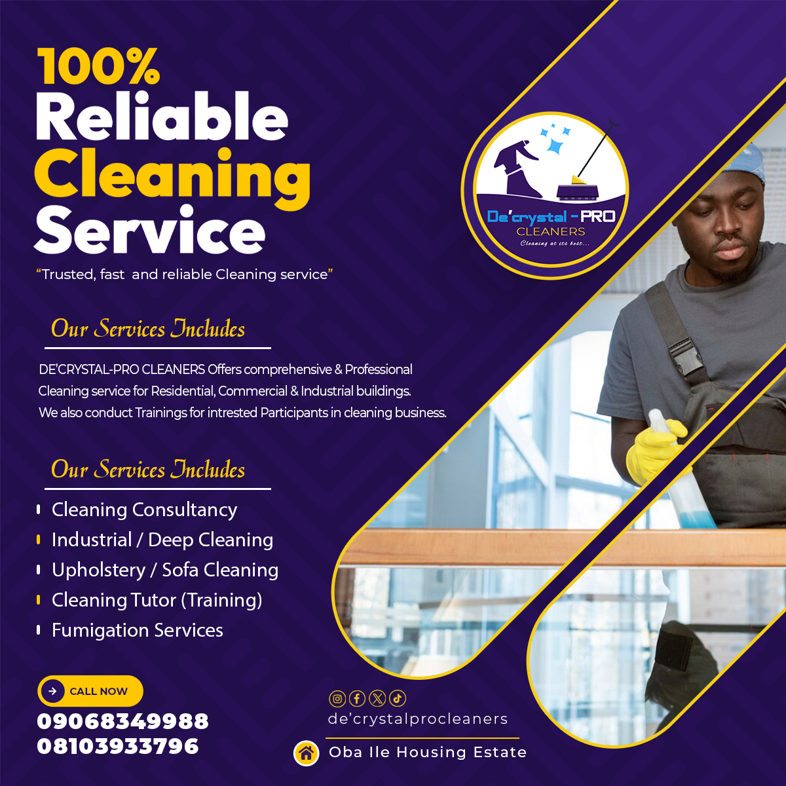

# FCB-CLEANING-PROJECT
## **INTRODUCTION TO INDUSTRIAL CLEANING** 
---
### Definition
Industrial cleaning is the process of *cleaning* and maintaining large-scale facilities,
such as factories, warehouses, manufacturing, etc. It involves the use of specialised equipment,
techniques,and cleaning chemicals to ensure a safe, clean, and productive working environment.
### Types of Industrial Cleaning:
- Floor cleaning (sweeping, scrubbing, polishing)
- Surface cleaning (wipes, sprays, degreasers)
- Equipment cleaning (pressure washing, steam cleaning)
- Specialized cleaning (tank cleaning, pipe cleaning, duct cleaning)
### Common Machines and Equipment Needed for Industrial Cleaning:
#### 1. Floor cleaning machines:
* *Sweepers (ride-on, walk-behind)*
* *Scrubbers (automatic, manual)*
* *Polishers (buffer, burnisher)*
  
Site to to get these cleaning machines [click here](https://www.kaercher.com/us/)


```
Google Query Sheet
SELECT * FROM TABLE 1
Where condition = MET




